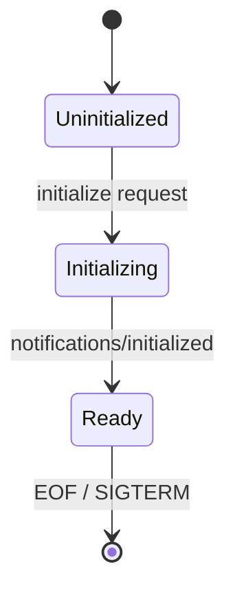
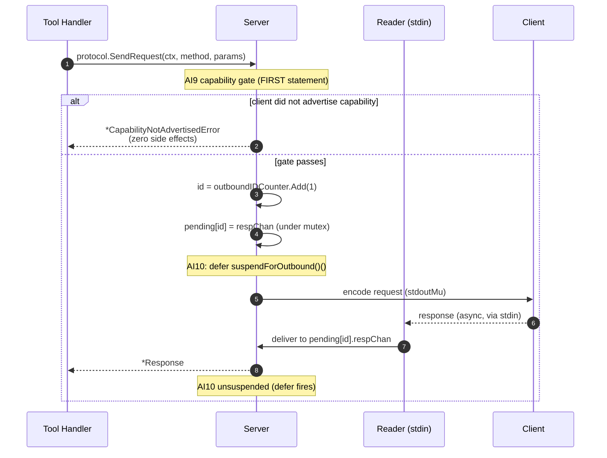

# Architecture

**Project:** `github.com/andygeiss/mcp`
**Pattern:** layered with strict dependency direction
**Primary boundary:** stdin/stdout (JSON-RPC 2.0, NDJSON)

---

## Executive summary

A single Go binary that implements the Model Context Protocol over stdin/stdout. No HTTP layer, no router, no third-party dependencies. The architecture is deliberately flat — complexity is added only when the code demands it. The single biggest design choice is the transport: NDJSON on stdio, with stdout reserved for protocol bytes and stderr reserved for `slog.JSONHandler` diagnostics.

## Architectural style

- **Layered monolith.** No bounded contexts, no hexagonal layering, no service boundaries inside the binary.
- **Strict dependency direction:** `cmd/mcp/ → internal/server/ → internal/protocol/`; `internal/server/` may import `internal/tools/`, `internal/resources/`, `internal/prompts/`. The `protocol/` and `schema/` packages have **zero internal dependencies**.
- **Reflection-driven schema derivation.** Tool/prompt input schemas are computed once per `reflect.Type` (cached) from struct tags (`json`, `description`).
- **Sequential dispatch as the load-bearing constraint** — see [Load-bearing constraints](#load-bearing-constraints).

## Load-bearing constraints

Two constraints hold without exception across every wave of Q1. They are the architectural footing every other decision rests on; treat both as preconditions, not preferences.

**Sequential dispatch.** The server advertises `experimental.concurrency.maxInFlight: 1` and enforces single-threaded handler execution in the dispatch loop. This is the constraint that lets the codec, the three-state lifecycle, the bidi `Peer`, and the conformance goldens stay small enough to audit. Every "would this need a lock?" question collapses to "no, dispatch serializes it." It held under `Register[In, Out]` generics, the AI9/AI10 invariants, and bidi-test concurrency tightening without modification. **Concurrency proposals (parallel handlers, request pipelining, in-flight notifications) must be evaluated against this constraint before any code change** — lifting `maxInFlight` re-derives the codec, the state machine, the bidi correlation map, and every golden simultaneously.

**Stdlib-only.** Zero `go.mod` deltas across thirteen Q1 stories touching protocol envelope, dispatch, schema reflection, generics, capability enum, AI9/AI10 enforcement, bidi tests, goldens, and version negotiation. Forces first-principles solutions (counting reader vs `io.LimitReader`, `slices.Contains` vs a set library, `sync.Once` vs DI frameworks) that compound into the audit story.

Stdlib-only is the visible moat; sequential dispatch is the architectural one. Both must hold.

## Component map

```
cmd/mcp/main.go       Entry point — wiring only. Parses --version, sets up
                      signal.NotifyContext on SIGINT/SIGTERM, builds tool
                      registry, constructs Server, calls Run, exits.

internal/protocol/    Foundation. Zero dependencies on other internal packages.
  codec.go            JSON-RPC 2.0 encoder/decoder; validates jsonrpc=2.0,
                      depth (MaxJSONDepth=64), top-level type, batch rejection.
  message.go          Request, Response, Error types.
  constants.go        MCP version (2025-11-25), error codes, method names,
                      MaxJSONDepth=64.
  capabilities.go     ClientCapabilities + the Capability enum used for AI9.
  errors.go           Typed errors: ErrPendingRequestsFull, ErrServerShutdown,
                      ErrNoPeerInContext, *CapabilityNotAdvertisedError,
                      *ClientRejectedError.
  peer.go             Peer interface (SendRequest), ContextWithPeer/PeerFromContext
                      helpers, MethodCapability for the AI9 gate. v1.x
                      stability commitment per ADR-003.

internal/schema/      Reflection engine. Zero dependencies. Used by both tools
                      and prompts to derive JSON Schema from struct tags.

internal/tools/       Tool registry + handler primitives.
  registry.go         Register[T], Lookup, deterministic List ordering.
  echo.go             Reference handler (// START HERE anchor).
  validate.go         Input validation against the derived schema.
  annotations.go      Tool annotation metadata.
  _TOOL_TEMPLATE.go   //go:build ignore — copy-target for new tools.

internal/resources/   Resource registry, static resources, URI templates.
  registry.go         Register, RegisterTemplate, deterministic List.

internal/prompts/     Prompt registry with reflection-derived argument schemas.

internal/server/      The lifecycle, dispatch, and bidi transport layer.
  server.go           Server type, three-state lifecycle, Peer compile-time
                      assertion, pendingEntry + outboundIDCounter (atomic.Int64),
                      clientCaps (atomic.Pointer[ClientCapabilities]).
  dispatch.go         Routing, method gating per state, ContextWithPeer at
                      handler entry, A7 cancel emission.
  decode.go           Reads from stdin via persistent json.Decoder + counting
                      reader (per-message size limit, NOT cumulative LimitReader).
  inflight.go         In-flight request tracking, timeout, cancellation.
  counting_reader.go  Per-message byte counting; resets per message.
  progress.go         *Progress emitted via context; nil-safe Report/Log.
  handlers.go         Common handler infrastructure.
  handlers_initialize.go   `initialize` handshake; snapshots clientCaps.
  handlers_logging.go      `logging/setLevel` (stderr slog level).
  handlers_prompts.go      `prompts/list`, `prompts/get`.
  handlers_resources.go    `resources/list`, `resources/read`,
                            `resources/templates/list`.
```

## Lifecycle (three-state machine)



| State | Allowed methods | All other methods |
|---|---|---|
| **Uninitialized** | `initialize`, `ping` | `-32000` ("server not initialized") |
| **Initializing** | `ping` | `-32000` |
| **Ready** | all methods | n/a |

- `initialize` request → server emits capabilities, transitions Uninitialized → Initializing.
- `notifications/initialized` → Initializing → Ready (silently ignored in any other state).
- Duplicate `initialize` in any state → `-32000`.
- `ping` always works.

## Transport

- **stdin:** persistent `json.NewDecoder` for the process lifetime. **No `bufio.Scanner`** (its 64 KB token cap silently truncates). Per-message size capped at 4 MB via a counting reader that **resets per message** — `io.LimitReader` is cumulative and would silently strangle long-lived connections.
- **stdout:** every byte must be a valid JSON-RPC message. A stray `fmt.Println` corrupts the wire and the client disconnects silently. Enforced by `forbidigo` lint rules in `.golangci.yml` (Invariant I4).
- **stderr:** `log/slog` with `slog.JSONHandler` exclusively. No plain `log.Print`.
- **EOF semantics:** `io.EOF` / `io.ErrUnexpectedEOF` → clean shutdown (exit 0). All other decode errors → fatal (exit 1).
- **Signals:** `signal.NotifyContext` on `SIGINT` / `SIGTERM` with cancel cause (Go 1.26). Server cancels in-flight context. **No drain — exit promptly.**

## JSON-RPC 2.0 specifics

| Behavior | Implementation |
|---|---|
| Framing | Newline-delimited JSON objects |
| Batch requests | Rejected with `-32700` |
| Missing/null `params` | Normalized to `{}` |
| Request `id` | Preserved as `json.RawMessage`, echoed verbatim — never re-marshaled |
| Notifications | A message without `id` is fire-and-forget; never responded to |
| Unknown notifications | Silently ignored — no log, no response, no telemetry |
| `rpc.*` methods | Reserved → `-32601` |
| Error messages | Contextual (e.g. `"unknown tool: foo"`, never just `"invalid params"`) |
| `tools/list` ordering | Deterministic across calls |

## Bidirectional transport (server → client)

Tool handlers can issue requests to the client (sampling, elicitation, roots, or any future method) via `protocol.SendRequest(ctx, method, params)`. The server attaches itself as a `protocol.Peer` to the handler's context (`protocol.ContextWithPeer`) at dispatch — handler packages never import `internal/server` (Invariant I1, CI-enforced via `depguard.no-server-in-handlers`).



**Correlation primitive:** mutex-protected pending-request map keyed by monotonic `atomic.Int64` IDs (`outboundIDCounter`). The `respChan` is buffer-1 and **never closed** (Invariant I3 — closing races the cancel path).

**AI9 capability gate:** outbound `sampling/`, `elicitation/`, `roots/` calls return `*protocol.CapabilityNotAdvertisedError` with **zero side effects** (pending-map untouched, no bytes written) when the client did not advertise the corresponding capability during `initialize`. The check is the first statement on the outbound path.

**Stability commitment:** the `Peer` method set and parameter types are a **v1.x stability surface** per ADR-003.

**AI10 enforcement (Q6):** `(*Server).SendRequest` brackets its outbound await with `defer ProgressFromContext(ctx).suspendForOutbound()()`, so any `Progress.Report` invocation between outbound dispatch and response correlation is dropped at the source. This prevents `notifications/progress` from interleaving with the awaited inbound response on the wire — which would otherwise corrupt the pending-request map's response correlation. Cross-references: [Progress reporting](./development-guide.md#progress-reporting-from-tool-handlers) and ADR-003 §Invariants.

See [ADR-003](./adr/ADR-003-bidi-reader-split.md) for the reader-split design and four ratified invariants (AI7–AI10).

## Schema derivation

Tool and prompt input schemas are derived by `internal/schema/schema.go` via reflection:
1. `T` must be a struct (or `*struct`) — `int`, `map`, slice-of-primitive at the top level error out.
2. Exported fields with `json` and `description` tags become schema properties.
3. Required vs. optional follows Go pointer convention (non-pointer = required).
4. Derivation is **computed once per `reflect.Type` and cached**; never per-request.

This means adding a tool is: define an input struct → write `func(ctx, T) Result` → call `tools.Register[T]` in `cmd/mcp/main.go`. No manual JSON Schema needed.

## Initialization & registries

`cmd/mcp/main.go` is wiring-only:
1. Handle `--version`.
2. `signal.NotifyContext` for graceful shutdown.
3. `tools.NewRegistry()`, register tools.
4. `server.NewServer(name, version, registry, stdin, stdout, stderr, opts...)`.
5. `srv.Run(ctx)`.

`server.NewServer` accepts functional options — including `server.WithTrace`, `server.WithResources`, `server.WithPrompts`. The `resources` and `prompts` capabilities are auto-advertised when their registries are configured.

## Resilience

- **Per-message cap:** 4 MB (counting reader).
- **JSON depth cap:** 64 (`MaxJSONDepth`) — prevents stack-exhaustion attacks; codec scans for balanced `{` / `[` before `Unmarshal`.
- **Handler timeout:** 30 seconds (`defaultHandlerTimeout`); on expiry the handler is cancelled and the client receives `-32001` (`ServerTimeout`).
- **Pending map cap:** 1024 (`maxPendingRequests`); excess returns `protocol.ErrPendingRequestsFull`.
- **Panic recovery:** handlers run inside a recovery wrapper; panics become `-32603` (`InternalError`).

## Security posture

- **Threat-model untrusted input by default.** Stdin payloads, tool arguments, URI template substitutions are treated as adversarial.
- **Validate at protocol boundaries.** Codec validates structure, version, depth before dispatch; tool handlers validate against the derived schema.
- **stdlib over hand-rolled.** No custom crypto, no string-built shell/SQL/exec invocations.
- **Supply chain:** cosign keyless signing, SBOM attached per archive, SLSA L3 provenance via `slsa-framework/slsa-github-generator`, OSS-Fuzz integration on `internal/protocol/`.
- **CI gates:** `codeql`, `scorecard`, `fuzz` workflows must pass.
- **`MCP_TRACE`** is debug-only — see [environment variables](./deployment-guide.md#environment-variables) for the production caveat.

## Error code taxonomy

| Code | Meaning | Triggers |
|---|---|---|
| `-32700` | Parse error | malformed JSON, size limit exceeded, batch array |
| `-32600` | Invalid request | bad structure, wrong `jsonrpc` version, `params` not an object |
| `-32601` | Method not found | unknown method, `rpc.*` reserved |
| `-32602` | Invalid params | wrong types, missing required fields, unknown tool name |
| `-32603` | Internal error | should not occur in normal operation |
| `-32002` | Resource not found | `resources/read` URI does not match any registered resource or template |
| `-32001` | Server timeout | tool handler timed out or was cancelled |
| `-32000` | Server error | state prevents processing — not initialized, already initialized, busy |

## Testing strategy

| Layer | What it covers | Where |
|---|---|---|
| **Unit (black-box `_test`)** | Handler logic, schema derivation, registry semantics | Per package |
| **Integration (`//go:build integration`)** | Full dispatch path through `bytes.Buffer`-injected stdio | `internal/server/`, `internal/tools/` |
| **Golden** | Byte-for-byte JSON comparison for wire-format stability | `internal/server/testdata/conformance/` |
| **Fuzz** | Adversarial input on the decoder | `internal/protocol/`, target `Fuzz_Decoder_With_ArbitraryInput` |
| **Conformance** | 37 fixture pairs covering wire shapes per NFR-M5 | `internal/server/testdata/conformance/` |
| **Bench** | benchstat-compared against `testdata/benchmarks/baseline.txt` | `internal/...` |

`t.Parallel()` is mandatory on every test; race detector (`-race`) is mandatory on every run.

## Out of scope (deliberate non-goals)

- HTTP, WebSocket, or any non-stdio transport
- External `go.mod` dependencies (CI tooling exempt)
- Third-party assertion libraries (testify, gomega) — `internal/assert.That` is the project's only assertion primitive
- `*/list_changed` notifications (planned for v1.4.0)
- Server-hosted `sampling/*`, `elicitation/*`, `completion/*`, `roots/list`, `resources/{subscribe,unsubscribe}` methods — the bidi primitive lets a tool handler call the *client* for these, but the server does not expose them

## See also

- [Source Tree Analysis](./source-tree-analysis.md) — directory-by-directory map
- [Development Guide](./development-guide.md) — building, testing, fuzzing
- [Deployment Guide](./deployment-guide.md) — releases, signing, verification
- [Agent Rules](./agent-rules.md) — operational rules sheet for AI agents
- [CLAUDE.md](../CLAUDE.md) — engineering philosophy
